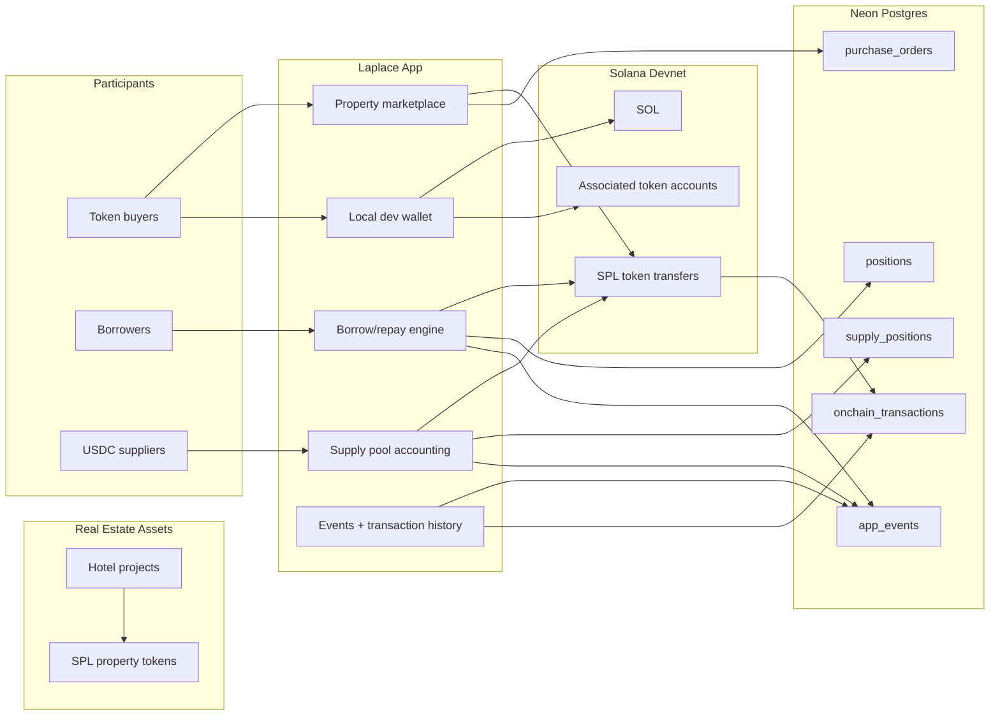
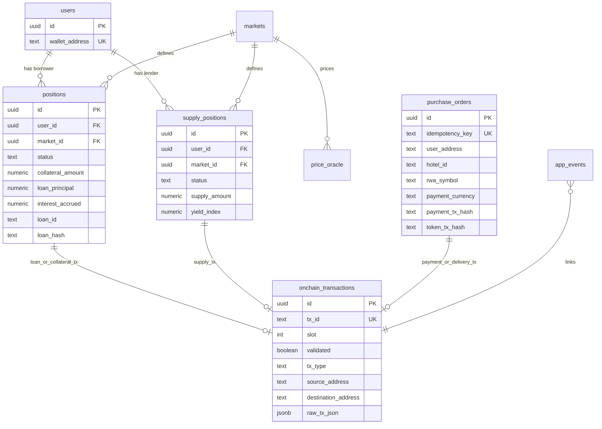
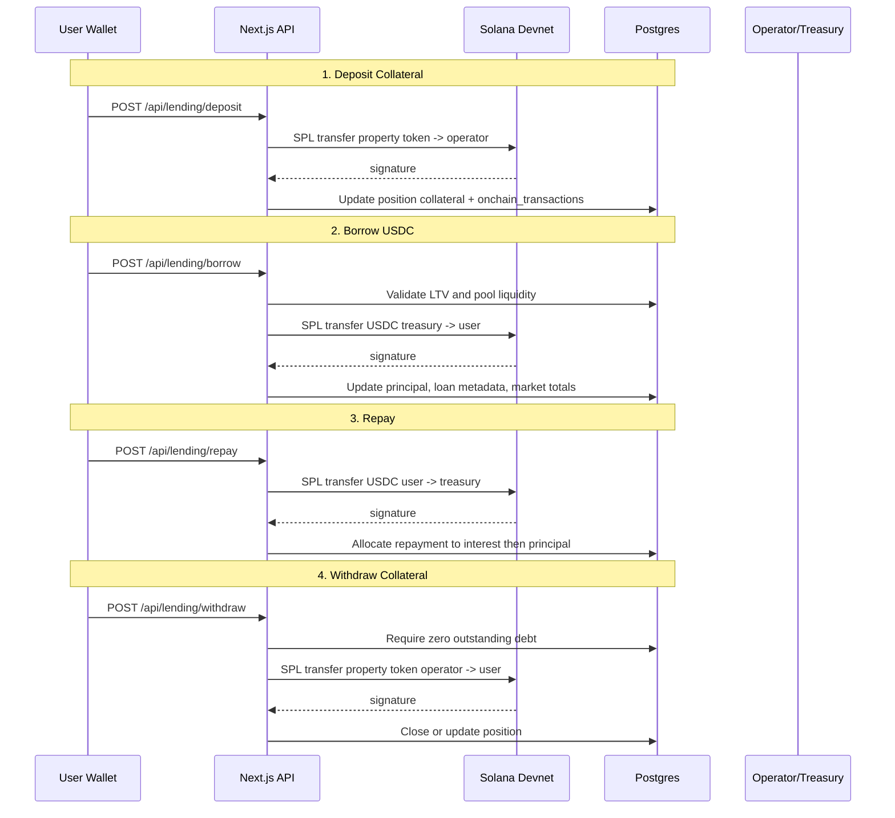

# Laplace: a RWA native On-Chain Credit & Lending Protocol for Tokenized Real Estate on Solana

Laplace is a Solana devnet MVP for turning premium real estate tokens into usable collateral. It connects property token purchase, wallet balances, lending supply, collateral deposit, USDC borrowing, repayment, and withdrawal in one working application.

Built for Solana Frontier Hackathon (April 6 - May 11, 2026).

- Website: `https://www.laplacetoken.com/`
- Pitch Video: `https://www.youtube.com/watch?v=p5Fy0A139i4`
- X: `https://x.com/laplace_global`

## 1. Project Overview

Tokenized real estate is easy to display but hard to reuse financially. Laplace focuses on the next step: allowing tokenized property exposure to support credit flows without forcing investors to sell the underlying asset.

This MVP uses Solana devnet and SPL token transfers to demonstrate:

- Purchasable property tokens for hotel assets
- USDC payment and funding flows
- Protocol-managed collateral custody through an operator wallet
- Lending supply and withdrawal
- Borrow, repay, and collateral withdrawal flows
- App-level loan, pool, price, and audit state persisted in Postgres

The current implementation is intentionally demo-oriented. Solana is used for wallet creation, SOL funding, SPL token balances, associated token accounts, and token transfers. Loan accounting, LTV, interest, price oracle values, idempotency, and position state are managed by the application database.

## 2. Problem

Real estate is the largest asset class in the world, but tokenized real estate often stops at ownership representation. Once a user buys tokenized exposure, that asset usually remains static:

- It cannot easily be pledged as collateral.
- Credit state is not reusable across platforms.
- Lenders lack a consistent view of collateral and debt.
- Investors often need to sell exposure to unlock liquidity.

The bottleneck is no longer only token issuance. The missing layer is reusable credit infrastructure for real-world assets.

## 3. Solution

Laplace demonstrates a Solana-based credit layer for real estate RWAs:

- Users acquire real assets-backed property tokens.
- Users lock property tokens as collateral by transferring them to a protocol-managed operator address.
- Borrowers receive USDC from the treasury wallet within LTV limits.
- Suppliers provide USDC liquidity and track supply positions.
- Repayments update debt and unlock collateral withdrawal.
- Each state-changing token movement stores a Solana transaction signature in the app audit tables.

This provides a visible MVP path from "own tokenized property" to "reuse tokenized property as collateral."

## 4. Application Walkthrough

Local app:

```bash
pnpm dev
```

The dev server runs with HTTPS on port `3001`.

1. Prepare protocol accounts and tokens
   - Configure `.env.local` with `DATABASE_URL`, `TREASURY_WALLET_SECRET`, and `OPERATOR_WALLET_SECRET`.
   - Run `pnpm dev-tools protocol-accounts` to generate demo service accounts when needed.
   - Run `pnpm dev-tools demo-mints --payer-role operator --payer-airdrop 1` to create demo SPL mints when the defaults are not suitable.
   - Run `pnpm db:up` to push the Drizzle schema and seed markets.

2. Generate a local wallet
   - Navigate to `/admin`.
   - Use the local wallet tools to generate a browser-stored Solana wallet.
   - Fund it with SOL and request demo property tokens or USDC from the faucet tools.

3. Buy property tokens
   - Navigate to `/discover`.
   - Open a purchasable hotel such as THE SAIL or NYRA.
   - Complete a USDC wallet payment.
   - The app transfers USDC to the treasury and transfers the selected property token back to the user.

4. Supply USDC liquidity
   - Navigate to `/lend`.
   - Select a market such as `SAIL-USDC`.
   - Supply USDC to the pool.
   - The app transfers USDC from the user wallet to the treasury and records the supply position.

5. Deposit collateral and borrow
   - Navigate to `/borrow`.
   - Select the target market.
   - Deposit property tokens as collateral.
   - Borrow USDC up to the available LTV and pool liquidity.

6. Repay and withdraw collateral
   - Repay USDC from `/borrow`.
   - Once debt is fully repaid, withdraw collateral.
   - The operator wallet sends the locked property tokens back to the user wallet.

7. Inspect on-chain evidence
   - Use transaction links returned by the API/UI.
   - Check `onchain_transactions.tx_id` for stored Solana signatures.
   - Open signatures in Solana Explorer with the `devnet` cluster.

### What is verifiable on-chain

- SOL airdrops and SOL transfers
- SPL token mint and transfer activity
- Associated token account creation during transfers
- USDC payments for property purchases
- Property token delivery to buyers
- Collateral transfer from user wallet to operator wallet
- USDC borrow disbursement from treasury to borrower
- USDC repayment from borrower to treasury
- Collateral release from operator wallet to borrower
- USDC supply and withdrawal transfers

### What is app-managed

- User identity anchored to wallet address
- Purchase order lifecycle
- Lending market configuration
- Price oracle values
- LTV, interest, health factor, and repayment allocation
- Borrower positions and supplier positions
- Pool totals, utilization, and yield index
- Idempotency and app event audit trail

## 5. Technology and Solana Features

### Core Functions

| Function | Description | App Link | Code Link |
| --- | --- | --- | --- |
| Purchase | Pay USDC and receive property tokens | `/discover`, `/hotel/[id]` | [`src/app/api/purchase/route.ts`](src/app/api/purchase/route.ts) |
| Onramp | Send demo USDC from treasury to a wallet | `/wallet` | [`src/app/api/onramp/route.ts`](src/app/api/onramp/route.ts) |
| Offramp | Send demo USDC from a wallet to treasury | `/wallet` | [`src/app/api/offramp/route.ts`](src/app/api/offramp/route.ts) |
| Supply | Supply USDC liquidity to a lending market | `/lend` | [`src/app/api/lending/markets/[marketId]/supply/route.ts`](src/app/api/lending/markets/%5BmarketId%5D/supply/route.ts) |
| Deposit | Lock property token collateral with the operator wallet | `/borrow` | [`src/app/api/lending/deposit/route.ts`](src/app/api/lending/deposit/route.ts) |
| Borrow | Disburse USDC from treasury within LTV limits | `/borrow` | [`src/app/api/lending/borrow/route.ts`](src/app/api/lending/borrow/route.ts) |
| Repay | Transfer USDC repayment and reduce debt | `/borrow` | [`src/app/api/lending/repay/route.ts`](src/app/api/lending/repay/route.ts) |
| Withdraw | Release fully repaid collateral back to borrower | `/borrow` | [`src/app/api/lending/withdraw/route.ts`](src/app/api/lending/withdraw/route.ts) |
| Liquidate | Not implemented in this Solana MVP | - | [`src/app/api/lending/liquidate/route.ts`](src/app/api/lending/liquidate/route.ts) |

### Solana Wallet and Native Asset

| Capability | Code Link |
| --- | --- |
| Generate local keypair | [`src/lib/client/solana.ts`](src/lib/client/solana.ts) |
| Serialize/restore bs58 keypair secret | [`src/lib/client/solana.ts`](src/lib/client/solana.ts) |
| Request devnet SOL airdrop | [`src/lib/client/solana.ts`](src/lib/client/solana.ts) |
| Transfer SOL | [`src/lib/client/solana.ts`](src/lib/client/solana.ts) |
| Build explorer links | [`src/lib/config/runtime.ts`](src/lib/config/runtime.ts) |

### SPL Tokens

| Capability | Code Link |
| --- | --- |
| Read token balances | [`src/lib/client/solana.ts`](src/lib/client/solana.ts) |
| Check associated token account readiness | [`src/lib/client/solana.ts`](src/lib/client/solana.ts) |
| Create associated token account idempotently | [`src/lib/client/solana.ts`](src/lib/client/solana.ts) |
| Transfer checked SPL token amounts | [`src/lib/client/solana.ts`](src/lib/client/solana.ts) |
| Default demo token mint addresses | [`src/lib/config/defaults.ts`](src/lib/config/defaults.ts) |
| Demo mint creation tools | [`scripts/dev-tools.ts`](scripts/dev-tools.ts) |

### Lending Engine

| Component | Purpose | Code Link |
| --- | --- | --- |
| Service orchestration | Deposit, borrow, repay, withdraw, supply, collect yield | [`src/lib/lending/solana-service.ts`](src/lib/lending/solana-service.ts) |
| Calculations | Interest, LTV, health factor, borrow/withdraw limits | [`src/lib/lending/calculations.ts`](src/lib/lending/calculations.ts) |
| Positions | Borrower collateral and debt state | [`src/lib/lending/positions.ts`](src/lib/lending/positions.ts) |
| Supply positions | Supplier balance state | [`src/lib/lending/supply.ts`](src/lib/lending/supply.ts) |
| Pool metrics | Utilization, liquidity, APR/APY, yield index | [`src/lib/lending/pool.ts`](src/lib/lending/pool.ts) |
| App events | Idempotency and audit trail | [`src/lib/lending/events.ts`](src/lib/lending/events.ts) |
| On-chain transaction store | Normalized Solana signature records | [`src/lib/lending/onchain.ts`](src/lib/lending/onchain.ts) |

## 6. Architecture at a Glance



Key areas:

- Tokenization first: real estate projects map to property token symbols such as `SAIL` and `NYRA`.
- Collateralized borrowing: users lock property tokens by transferring them to the operator wallet.
- Pool liquidity: USDC suppliers fund the treasury-side liquidity pool.
- Solana-backed settlement: all asset movements are Solana devnet transactions.
- App-managed credit: loan state and risk calculations live in Postgres, not a deployed Solana program.

## 7. Repository Structure

```text
src/
+-- app/
|   +-- api/
|   |   +-- purchase/route.ts
|   |   +-- onramp/route.ts
|   |   +-- offramp/route.ts
|   |   +-- balances/route.ts
|   |   +-- faucet/route.ts
|   |   +-- lending/
|   |       +-- borrow/route.ts
|   |       +-- deposit/route.ts
|   |       +-- repay/route.ts
|   |       +-- withdraw/route.ts
|   |       +-- liquidate/route.ts
|   |       +-- markets/[marketId]/
|   |           +-- supply/route.ts
|   |           +-- withdraw-supply/route.ts
|   |           +-- collect-yield/route.ts
|   +-- admin/page.tsx
|   +-- borrow/page.tsx
|   +-- discover/page.tsx
|   +-- lend/page.tsx
|   +-- portfolio/page.tsx
|   +-- wallet/page.tsx
+-- data/
|   +-- catalog-properties.ts
|   +-- hotels.ts
|   +-- property-tokens.ts
+-- lib/
|   +-- chain/
|   |   +-- client.ts
|   |   +-- config.ts
|   |   +-- service-account.ts
|   |   +-- storage.ts
|   +-- client/
|   |   +-- solana.ts
|   |   +-- solana-wallet-storage.ts
|   +-- config/
|   |   +-- defaults.ts
|   |   +-- runtime.ts
|   +-- db/
|   |   +-- schema.ts
|   |   +-- seed.ts
|   +-- lending/
|       +-- calculations.ts
|       +-- events.ts
|       +-- onchain.ts
|       +-- pool.ts
|       +-- positions.ts
|       +-- solana-service.ts
|       +-- supply.ts
scripts/
+-- dev-tools.ts
+-- init-db.ts
+-- reset-db.ts
tests/
+-- unit/
```

## 8. DB to Solana Relationship



Mapping rules:

- `users.wallet_address` -> Solana wallet public key
- `markets.collateral_issuer` and `markets.debt_issuer` -> SPL mint addresses
- `purchase_orders.payment_tx_hash` -> USDC payment signature
- `purchase_orders.token_tx_hash` -> property token delivery signature
- `positions.loan_hash` -> latest borrow disbursement signature
- `onchain_transactions.tx_id` -> Solana transaction signature
- `app_events.onchain_tx_id` -> normalized audit link to transaction evidence

## 9. Lending Lifecycle



## 10. API Surface

### Wallet and Asset Operations

| Endpoint | Method | Purpose |
| --- | --- | --- |
| `/api/balances?address=...` | GET | Fetch SOL and configured SPL token balances |
| `/api/admin/sol` | POST | Send demo SOL from treasury to a wallet |
| `/api/faucet` | POST | Send demo SPL tokens from faucet/treasury flow |
| `/api/onramp` | POST | Send demo USDC from treasury to user wallet |
| `/api/offramp` | POST | Send demo USDC from user wallet to treasury |

### Property and Portfolio Operations

| Endpoint | Method | Purpose |
| --- | --- | --- |
| `/api/purchase` | POST | Create purchase order, collect USDC, deliver property token |
| `/api/portfolio?address=...` | GET | Read completed purchases for a wallet |
| `/api/waitlist` | POST | Store waitlist email |

### Lending Operations

| Endpoint | Method | Purpose |
| --- | --- | --- |
| `/api/lending/config` | GET | Read market, token, and loan configuration |
| `/api/lending/prices` | GET/POST | Read or update mock oracle prices |
| `/api/lending/position?userAddress=...&marketId=...` | GET | Fetch borrower position, metrics, loan overview, and events |
| `/api/lending/deposit` | POST | Lock collateral through an SPL token transfer |
| `/api/lending/borrow` | POST | Borrow USDC within LTV and liquidity limits |
| `/api/lending/repay` | POST | Repay USDC and reduce interest/principal |
| `/api/lending/withdraw` | POST | Release collateral when debt is repaid |
| `/api/lending/liquidate` | POST | Returns `501`; outside current MVP scope |

### Supply Operations

| Endpoint | Method | Purpose |
| --- | --- | --- |
| `/api/lending/markets/[marketId]` | GET | Read market and pool metrics |
| `/api/lending/markets/[marketId]/supply` | POST | Supply USDC liquidity |
| `/api/lending/markets/[marketId]/withdraw-supply` | POST | Withdraw supplied USDC |
| `/api/lending/markets/[marketId]/collect-yield` | POST | Return current yield collection result |
| `/api/lending/markets/[marketId]/supply-positions/[lenderAddress]` | GET | Read a supplier position |
| `/api/lending/lenders/[lenderAddress]/supply-positions?marketId=...` | GET | Read supplier event history |

## 11. Devnet Transaction Evidence

This repository does not commit a fixed public transaction table. Evidence is generated by the local/devnet flow and persisted in the database.

Useful places to inspect:

- `onchain_transactions.tx_id`: Solana transaction signature
- `onchain_transactions.tx_type`: normalized operation type such as `ASSET_LOCK`, `BORROW_DISBURSEMENT`, `REPAYMENT`, `COLLATERAL_RELEASE`, `SUPPLY_DEPOSIT`, or `SUPPLY_WITHDRAWAL`
- `onchain_transactions.raw_tx_json`: chain, signature, source/destination, amount, symbol, and mint metadata
- `purchase_orders.payment_tx_hash`: USDC payment transaction
- `purchase_orders.token_tx_hash`: property token delivery transaction
- API responses from purchase/lending flows: `txHash` and explorer URL where available

Explorer format:

```text
https://explorer.solana.com/tx/<signature>?cluster=devnet
```

## 12. Quick Start

### Prerequisites

- Node.js 18+
- pnpm
- Neon or Postgres database
- Solana devnet RPC access

### Setup

```bash
# Install dependencies
pnpm install

# Configure environment
cp .env.example .env.local

# Required:
# DATABASE_URL=postgresql://...
# TREASURY_WALLET_SECRET=<bs58 Solana keypair secret>
# OPERATOR_WALLET_SECRET=<bs58 Solana keypair secret>

# Optional but recommended for stable devnet demos:
# SOLANA_RPC_URL=https://devnet.helius-rpc.com/?api-key=...
# RESERVE_WALLET_SECRET=<bs58 Solana keypair secret>
# TREASURY_SOL_MINIMUM=5
# TREASURY_SOL_TARGET=20

# Optional: generate protocol accounts
pnpm dev-tools protocol-accounts

# Optional: create demo SPL mints when not using APP_DEFAULTS.demoMintAddresses
pnpm dev-tools demo-mints --payer-role operator --payer-airdrop 1

# Optional: top Treasury SOL up to the configured target from Reserve, with devnet airdrop fallback
pnpm dev-tools treasury-sol --minimum 5 --target 20

# Initialize database schema and seed default markets
pnpm db:up

# Start development server
pnpm dev
```

### Test Flow

1. Open `/admin` and generate a local wallet.
2. Fund the wallet with SOL and demo USDC/property tokens.
3. Open `/discover` and complete a property purchase.
4. Open `/lend` and supply USDC.
5. Open `/borrow`, deposit property tokens, and borrow USDC.
6. Repay USDC, withdraw collateral, and inspect `onchain_transactions`.

### Verification Commands

```bash
pnpm typecheck
pnpm test:unit
pnpm build
```

`pnpm build` can require network access for external assets/fonts depending on local environment.

## 13. Limitations

### Solana MVP Scope

- No custom Solana program is deployed in this repository.
- Collateral locking is represented by SPL token transfer to a protocol-controlled operator wallet plus app-managed position state.
- Loan terms, LTV, interest accrual, and repayment allocation are maintained in Postgres.
- Liquidation endpoint exists but intentionally returns `501`.
- Price oracle values are mock values in `price_oracle`.
- Local wallet secrets are stored in browser localStorage for demo convenience.

### Security Considerations

- The API accepts local account secrets for demo signing flows.
- There is no production authentication, KYC, or authorization layer.
- Treasury/operator secrets must never be committed.
- The demo assumes trusted service accounts with enough SOL and SPL balances.
- Production requires wallet-adapter signing, server-side key custody hardening, rate limits, monitoring, and formal security review.

## 14. Roadmap

### Technical

1. Replace localStorage demo wallet handling with Solana wallet adapter support.
2. Move collateral and loan state into a purpose-built Solana program or audited custody contract model.
3. Add real oracle integration for property token and USDC prices.
4. Implement liquidation with deterministic collateral seizure rules.
5. Add authenticated user sessions and production-grade authorization.
6. Add durable transaction reconciliation for pending/failed Solana signatures.

### Product

- Expand property catalog beyond demo hotel tokens.
- Add third-party RWA issuer onboarding.
- Improve institutional lender dashboard and underwriting workflow.
- Add compliance-aware investor onboarding.
- Publish reproducible devnet transaction evidence for demo submissions.

### Launch

- May 2026: Live on devnet.
- June 2026: Complete off-chain SPV setup.
- July 2026: Register legal & title deed and product distribution.
- August 2026: Launch on mainnet.

## 15. Tech Stack

| Layer | Technology |
| --- | --- |
| Frontend | Next.js 16, React 19, Tailwind CSS v4, shadcn/ui-style components |
| Backend | Next.js API Routes, TypeScript |
| Database | Neon/Postgres, Drizzle ORM |
| Blockchain | Solana devnet, `@solana/web3.js`, `@solana/spl-token` |
| Assets | SOL and SPL demo tokens (`SAIL`, `NYRA`, `ZAABEL`, `BURJV`, `AMANT`, `LEMARAIS`, `432PK`, `USDC`) |
| Math | Decimal.js |
| Tests | Node test runner via `tsx`, Playwright E2E |

## 16. Market Opportunity

Real estate remains one of the largest global asset classes, while tokenized real-world assets are expected to become a major on-chain category. The first wave of RWA products focused on issuance and ownership. Laplace targets the next layer: capital efficiency after ownership.

The key opportunity is to let investors keep exposure to real estate-backed tokens while accessing liquidity through collateralized credit. For issuers and lenders, a shared credit layer can create more repeatable underwriting, transaction visibility, and portfolio-level liquidity.

## 17. Business Model

Laplace can operate as protocol-based RWA credit infrastructure rather than a balance-sheet lender.

Revenue streams:

- Marketplace commission fee on sales, cherged by real estate developers
- Credit protocol fees for borrow, repay, collateral state transition, and liquidation events
- RWA onboarding and certification fees for property issuers
- Institutional API access for lenders and asset platforms
- Treasury or reserve spreads where legally and operationally permitted

The long-term model is infrastructure-level revenue tied to onboarded assets, active lenders, and reusable collateral volume.

## 18. Compliance Framework

This MVP is a technical demo and does not itself provide regulated investment, brokerage, custody, or lending services.

Production deployment requires:

- Jurisdiction-specific securities analysis for each RWA token
- Licensed distribution partners where investor solicitation is regulated
- KYC/AML and sanctions screening
- Clear custody, enforcement, and liquidation procedures
- Disclosure and risk documentation for investors and lenders
- Independent legal, tax, and security review

Laplace's intended role is protocol and infrastructure coordination: structuring tokenized real estate collateral workflows, anchoring transaction evidence on-chain, and exposing verifiable credit state to approved participants with licensed partners, fully complient.

## 19. Team

Yusuke Hirota (Founder & CEO): 10 years AI and blockchain business & technical background (biz dev, product, marketing, engneering). Ex-Amazon.
Johnathan Froeming (CTO): 15 years full-stack engineering. Ex-Amazon. Ex-bitbank (the largest crypto exchange in Japan).
Rindo Katsura (Tech Leads): 15 years full-stack engineering.

## 20. Quick Links

- GitHub: `git@github.com:laplace-global/hackathon-solana-colosseum-frontier.git`
- Local app: `https://localhost:3001`
- Solana Explorer: `https://explorer.solana.com/?cluster=devnet`
- Website: `https://www.laplacetoken.com/`
- X: `https://x.com/laplace_global`

## 21. Status

- Development: Launched Solana devnet MVP (May 2026)
- Chain state: SOL and SPL token transfers on devnet
- Credit state: App-managed Postgres lending ledger
- Liquidation: Out of scope for current MVP
- Next step: production wallet signing, smart-contract-backed collateral, published transaction evidence, and launch on main-net (August 2026)
